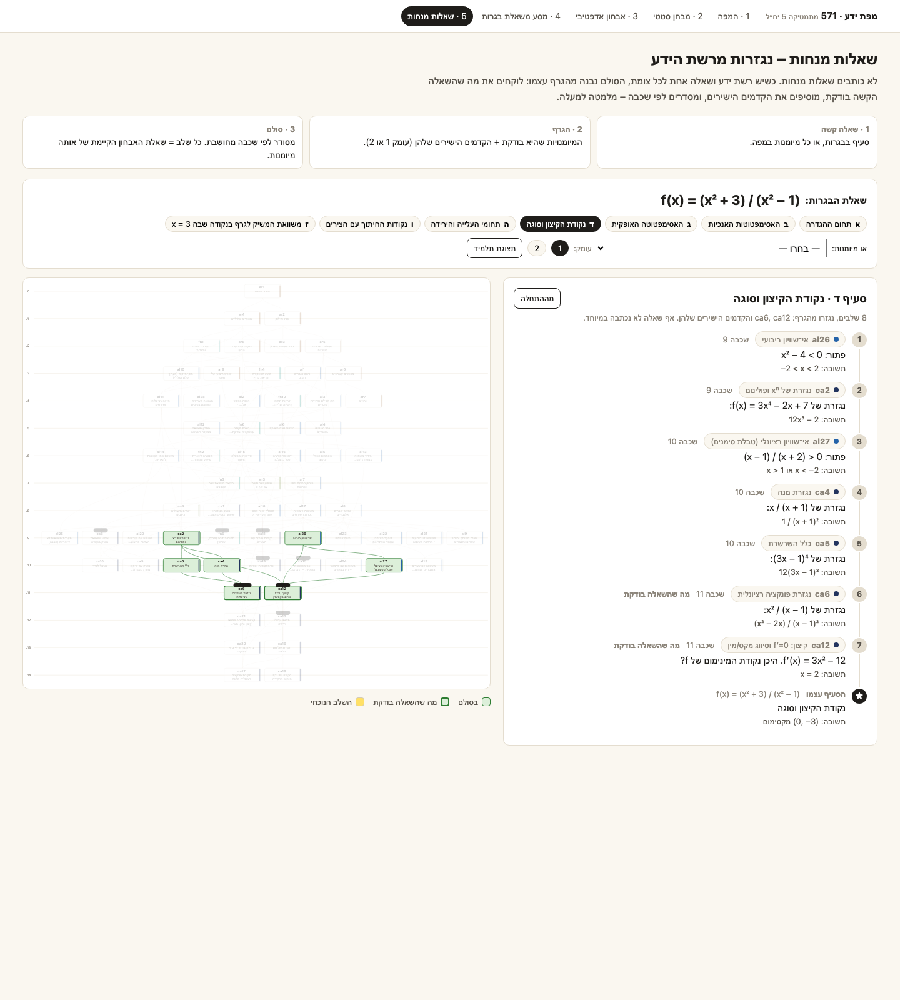

# מפת ידע לבגרות 571

**רשת ידע** של 156 מיומנויות במתמטיקה 5 יח״ל (שאלון 571). כל מיומנות היא צומת, וכל קשר קדם הוא קשת. כשיש רשת כזאת ושאלה אחת לכל צומת, שלושה דברים נגזרים ממנה **בלי לכתוב אף שאלה חדשה**:

1. **שאלות מנחות.** לכל שאלה קשה מקבלים סולם שאלות מלמטה למעלה, מתוך הגרף בלבד.
2. **אבחון.** מוצאים את המקום שבו החסר של התלמיד *מתחיל*, ולא רק את המקום שבו הוא נופל.
3. **מסלול השלמה.** מה ללמוד, ובאיזה סדר, עד שחוזרים לשאלת בגרות מאותו סוג.

<p align="center"></p>

## הרעיון בדוגמה אחת

סעיף ד׳ בשאלת הבגרות f(x) = (x²+3)/(x²−1) הוא ״מצא את נקודת הקיצון וסוגה״. הסעיף ממופה לשתי מיומנויות: `ca6` (נגזרת פונקציה רציונלית) ו־`ca12` (קיצון). הגרף יודע על מה הן נשענות:

```
ca6  ← ca4 נגזרת מנה, ca5 כלל השרשרת
ca12 ← ca2 נגזרת פולינום, al26 אי־שוויון ריבועי, al27 טבלת סימנים
```

כשממיינים את כל אלה לפי השכבה המחושבת, מתקבל **סולם של שאלות מנחות**. כל שלב בו הוא שאלת האבחון הקיימת של המיומנות:

| # | מיומנות | השאלה המנחה |
|---|---|---|
| 1 | al26 אי־שוויון ריבועי | פתור: x² − 4 < 0 |
| 2 | ca2 נגזרת פולינום | נגזרת של 3x⁴ − 2x + 7 |
| 3 | al27 טבלת סימנים | פתור: (x − 1)/(x + 2) > 0 |
| 4 | ca4 נגזרת מנה | נגזרת של x/(x + 1) |
| 5 | ca5 כלל השרשרת | נגזרת של (3x − 1)⁴ |
| 6 | ca6 נגזרת רציונלית | נגזרת של x²/(x − 1) |
| 7 | ca12 קיצון | f′(x) = 3x² − 12, היכן המינימום? |
| ★ | **הסעיף עצמו** | נקודת הקיצון של f וסוגה |

**במצב אישי** הסולם מתקצר. אחרי האבחון המנוע יודע מה התלמיד כבר שולט בו. לתלמיד שחסרה לו רק נגזרת מנה נשארים שני שלבים, `ca4 → ca6`, ואז הסעיף עצמו.

זה כל האלגוריתם: הקדמים הישירים, ממוינים לפי שכבה ([`guided_ladder`](engine/diagnostic.py)). הוא עובד לכל צומת במפה, והיום יש סולם מלא ל־64 מיומנויות. עוד 13 מיומנויות רחוקות שאלה אחת בלבד מסולם מלא: כל הקדמים שלהן כבר בבנק. כל שאלה שנוספת לבנק מרחיבה את מה שאפשר לייצר. הפירוט המלא, לכל סעיף, נמצא ב־[build/guided_questions.md](build/guided_questions.md), והדף האינטראקטיבי הוא [web/guided.html](web/guided.html).

## למה רשת ולא רשימת נושאים

ציון בבגרות אומר כמה התלמיד יודע, אבל לא *מה* חסר לו. תלמיד שנכשל בחקירת פונקציה יכול להיכשל בגלל נגזרת של מנה, בגלל פירוק טרינום שנלמד שלוש שנים קודם, או בגלל מספרים שליליים. רשימת נושאים לא מבחינה בין המקרים. רשת כן: כישלון מתגלגל בה למטה, דרך הקדמים, עד שמגיעים ל**פער השורש**, כלומר מיומנות שנכשלה וכל הקדמים שלה ידועים. שם מתחילים ללמוד. כל שאר הכישלונות הם סימפטומים.

חשוב להיות ישרים לגבי דבר אחד: **הפירוק לאטומים והקשרים ביניהם הם תוצר של תהליך עיצוב ידני** (שיחות, ביקורת, תיקונים), לא של אלגוריתם. הקוד לא ״מגלה״ את המפה. הוא **מאמת** אותה, **מחשב ממנה** שכבות, סגורים וכיסוי, ו**בונה עליה** שאלות מנחות, מבחנים, מנוע אדפטיבי ומסע משאלת בגרות. קובצי הנתונים ב־`data/` לא שונו.

## 2. התהליך, שלב אחר שלב, כולל הטעויות

הגרסה המלאה נמצאת ב־[docs/process.md](docs/process.md), והעקרונות שנקבעו בדרך ב־[docs/design-principles.md](docs/design-principles.md).

### ניסיון ראשון: 76 נושאים ב־9 שכבות ידניות (נזרק)
המפה הראשונה כללה כ־76 ״נושאים״ בתשע שכבות שנקבעו ביד, כמו ״אלגברה בסיסית״ ו״חדו״א״. הביקורת העלתה שתי בעיות:
- **״בעיית קיצון״ היא לא מיומנות אלא סוג שאלה.** היא משלבת שלוש מיומנויות שונות, ולכל אחת שורשים אחרים: לזהות את הגודל שצריך למקסם, לבנות מודל (גיאומטרי, טריגונומטרי, אנליטי או מספרי) ולמצוא את הקיצון. תלמיד שנופל בה יכול ליפול בכל אחת מהשלוש.
- **שכבה שנקבעה ביד לא אומרת כלום.** היא תווית של פרק בספר, לא טענה על הידע, ושום דבר לא מונע ממנה לסתור את הקשרים עצמם.

### ההגדרות שנקבעו
- **צומת** הוא משהו ששאלה אחת בודקת בבידוד.
- **שכבה** היא אורך המסלול הארוך ביותר מהצומת לבסיס. היא מחושבת ולא נשמרת בנתונים.
- **סוגי שאלות הם ציר נפרד.** סוג שאלה לא נכנס לגרף כצומת; הוא מצביע על המיומנויות הישירות שהוא משלב.
- **״מודליזציה״** (מטקסט למשוואה) היא תחום בפני עצמו (`md`), כי שם תלמידים נופלים.

### המפה השנייה: 156 מיומנויות, 15 שכבות מחושבות, 16 סוגי שאלות
במפה יש 305 קשרי קדם ושורש יחיד (`ar1`). היא עברה תיקונים מול השאלון עצמו: נוספה סדרה הנדסית אינסופית מתכנסת (`sq6`), והגיאומטריה האנליטית לא כוללת פרבולה ואליפסה.

| שלב | סקריפט | מה הוא עושה |
|---|---|---|
| אימות | [`01_validate_graph.py`](pipeline/01_validate_graph.py) | בודק: אין מעגלים, כל הקדמים קיימים, אין קשרים כפולים, אין צמתים מבודדים. נכשל בקוד יציאה ≠0 אם משהו שבור. |
| שכבות | [`02_compute_layers.py`](pipeline/02_compute_layers.py) | `layer(n) = 1 + max(layer(p))`. מוודא ששתי מיומנויות באותה שכבה לעולם לא תלויות זו בזו. |
| סגורים | [`03_closures.py`](pipeline/03_closures.py) | מחשב ancestors ו־descendants לכל מיומנות, סגור לכל סוג שאלה (q13 = 55 מיומנויות) וה״צמתים החמים״. |

### שאלות אבחון, ומה לא נכון בהן
נכתבו 64 שאלות, אחת לכל מיומנות: לכל 37 מיומנויות החשבון והאלגברה, ולעוד 27 מיומנויות שנמצאות מתחת לסוג השאלה ״חקירת פונקציה רציונלית״. המסיחים תוכננו כך שכל תשובה שגויה נובעת משגיאה מסוימת. בביקורת עלה ש**אלה מסיחים לוגיים, לא אמפיריים**: הם משקפים את מה שאנחנו חושבים שתלמידים טועים בו, לא את מה שתלמידים באמת בוחרים.

**ההחלטה:** האבחון נשען רק על נכון/שגוי ועל הגרף. המסיחים (ו־`likelyError` שלהם) הם השערות שיאומתו מנתוני תלמידים, והדפים מציגים אותם ככאלה.

**מה נשקל ונדחה:** לזהות את צעדי הפתרון עצמם (מקלדת מתמטית, בונה צעדים, זיהוי כתב יד). בשלב הזה זה יוצר יותר חיכוך מתועלת.

### מבחן סטטי ← מנוע אדפטיבי ← מסע משאלת בגרות
| שלב | סקריפט / קוד | מה הוא עושה |
|---|---|---|
| מבחן סטטי | [`04_static_test.py`](pipeline/04_static_test.py) | 15 שאלות קבועות מתוך 37. תשובה נכונה מסמנת את כל ה־ancestors כ״נגזרים״; שגויה מסמנת את כל ה־descendants ״בסיכון״. |
| מנוע | [`engine/diagnostic.py`](engine/diagnostic.py), [`engine/diagnostic.js`](engine/diagnostic.js) | מחסנית השערות, ירידה לשורש ובחירה מאוזנת. שתי הגרסאות זהות, וזה נבדק ב־[`tests/test_parity.py`](tests/test_parity.py). |
| סימולציה | [`05_simulate.py`](pipeline/05_simulate.py) | ארבעה תלמידים מדומים על האלגברה, ועוד אחד על המסע. |
| ווב | [`06_build_web.py`](pipeline/06_build_web.py) | חמישה דפים עצמאיים. |
| שאלות מנחות | [`07_guided_questions.py`](pipeline/07_guided_questions.py) | סולם שאלות מנחות לכל סעיף, שנגזר מהגרף, ומצב אישי שמדלג על מה שכבר ידוע. |

**על הבחירה הסטטית.** 15 השאלות נבחרו ביד בתהליך המקורי, לפי שני עקרונות: פיזור בין השכבות ועדיפות למיומנויות עם fan-out גבוה. הסקריפט מנסה לשחזר את הבחירה בכלל מפורש: `fanout × depth`, דילוג על חוליות בשרשרת, ולכל היותר 4 מיומנויות לשכבה. הכלל מגיע ל־**11 מתוך 15**, והסקריפט מסביר כל הבדל. ההבדל נובע משיפוט דידקטי שהגרף לא מכיל: אילו בסיסים (ar4, ar5, al3) שווה לבדוק במפורש. הדפים משתמשים ברשימה המקורית.

**הממצא של המסע.** אפשר שתלמיד ייכשל בסעיף בגרות למרות שכל המיומנויות של הסעיף ידועות לו כשבודקים אותן בנפרד. זו תוצאה שלישית, **״קושי בשילוב״**, לצד ״פער שורש״ ו״סימפטום״. היא דורשת תרגול אחר: תרגול של השאלה השלמה, לא של מיומנות אחת.

## 3. איך מריצים

```bash
make venv    # פעם אחת: יוצר .venv ומתקין jinja2 ו־pytest
make all     # מוחק את build/ ואת web/*.html, מריץ את כל הפייפליין ואת הבדיקות
```

הדפים נפתחים ישירות מהדיסק, בלי שרת ובלי רשת: `web/map.html`, `web/diagnostic_static.html`, `web/diagnostic_adaptive.html`, `web/journey.html`, `web/guided.html`. גם `build/` וגם `web/*.html` נמצאים בגיט, כך שאפשר לפתוח אותם בלי להריץ כלום. אם מוסיפים `#demo` לכתובת של דפים 2–4 (או לוחצים על כפתור ״הדגמה״), תלמיד מדומה עונה על השאלות עד הסיכום.

| סקריפט | מייצר |
|---|---|
| `01_validate_graph.py` | `build/data_issues.md`: קשתות עודפות, מיומנויות שאף סוג שאלה לא דורש, הערות מקריאה ידנית |
| `02_compute_layers.py` | `build/layers.json` |
| `03_closures.py` | `build/closures.json`, `build/coverage_report.md` |
| `04_static_test.py` | `build/static_test_algebra.json` |
| `05_simulate.py` | `build/simulations.md`, `build/simulations.json` |
| `06_build_web.py` | `web/*.html` (מהתבניות ב־`web/templates/`) |
| `07_guided_questions.py` | `build/guided_questions.md`, `build/guided_questions.json` |

`make screenshots` מצלם את הדפים ל־[`docs/screenshots/`](docs/screenshots/) עם Chrome, Chromium או Edge במצב headless.

### חמשת הדפים
| | דף | מה רואים |
|---|---|---|
| 1 | [המפה](web/map.html) | 156 מיומנויות בשורות לפי שכבה מחושבת. לחיצה על מיומנות צובעת את מה שהיא נשענת עליו בירוק ואת מה שהיא פותחת בכתום, ופאנל הצד מראה גם את סוגי השאלות שדורשים אותה ואת המסלול המלא. לחיצה על סוג שאלה מסמנת את כל הסגור שלו. יש גם ייצוא JSON. |
| 2 | [מבחן סטטי](web/diagnostic_static.html) | 15 שאלות, כולל אפשרות ״לא יודע״. בסוף: מדדים, פערי שורש, מסלול השלמה, מפה צבועה בחמישה מצבים וסקירת תשובות עם ה״שגיאה האפשרית״ של המסיח שנבחר. |
| 3 | [אבחון אדפטיבי](web/diagnostic_adaptive.html) | מעל כל שאלה מופיעה התיבה ״למה השאלה הזאת״. המפה נצבעת אחרי כל תשובה, ולוג ״מסלול ההיסק״ מתעד כל צעד. יש גם כפתור ״סיים עכשיו״. |
| 4 | [מסע](web/journey.html) | שלב 1: שאלת הבגרות על f(x) = (x²+3)/(x²−1), בשבעה סעיפים. שלב 2: המנוע על 55 המיומנויות של q13. שלב 3: מסלול השלמה ושאלות מנחות אישיות לכל סעיף שנפל, עד ״שאלת בגרות חדשה מאותו סוג, סעיף X״. |
| 5 | [שאלות מנחות](web/guided.html) | בוחרים סעיף או כל אחת מ־64 המיומנויות, ומקבלים סולם שאלות מנחות מלמטה למעלה, בעומק 1 או 2, בתצוגת תלמיד (שלב אחר שלב) או בתצוגת מורה (הכול עם תשובות). הקישור ניתן לשיתוף, למשל `guided.html#section=ד` או `#skill=al19`. |

## 4. תוצאות הסימולציות

תלמיד מדומה ״לא יודע״ את המיומנויות בעמודת הפער ואת כל מה שמעליהן, ועונה נכון על כל השאר. הפירוט המלא, שאלה אחרי שאלה, נמצא ב־[build/simulations.md](build/simulations.md).

| תסריט | פער אמיתי | שאלות | פערי שורש שנמצאו | במסלול | בסיכון | צפוי |
|---|---|---|---|---|---|---|
| יודע הכול | — | 20 | — | 0 | 0 | ~20 שאלות, 0 פערים |
| לא יודע al7 (פירוק טרינום) | al7 | 15 | al7 | 1 | 13 | ~15 שאלות, פער שורש יחיד: al7 |
| לא יודע ar4 (מספרים שליליים) | ar4 | 11 | ar4 | 6 | 23 | ~11 שאלות, ירידה al7→al5→al4→al3→al1→ar4 |
| לא יודע al15 ו־al13 | al15, al13 | 22 | al13, al15 | 4 | 1 | שני פערי שורש בדיוק, בלי סימפטומים |
| מסע: נופל בסעיף ד׳ בגלל ca4 | ca4 | 12 | ca4 | 2 | 1 | פער שורש ca4; סעיפים ד׳ ו־ז׳ מוסברים דרכו |

הבדיקות (`make test`, 155 בדיקות) מכסות גם את כל 37 המקרים של פער יחיד באלגברה. בכל אחד מהם המנוע מוצא בדיוק את השורש, והמנוע ב־JS נותן את אותה תוצאה כמו המנוע ב־Python בכל התסריטים, כולל הסולמות של השאלות המנחות.

## 5. מה חסר ומה הבא בתור

- **שאלות ל־92 המיומנויות הנותרות.** יש כרגע 64 שאלות: חשבון, אלגברה והסגור של q13. כל שאלה שנוספת נכנסת מיד לסולמות של השאלות המנחות, ו־13 מיומנויות צריכות רק שאלה אחת כדי לקבל סולם מלא (ראו [build/guided_questions.md](build/guided_questions.md)).
- **נתוני מסיחים אמיתיים.** צריך לאסוף אילו מסיחים תלמידים בוחרים בפועל, כדי לבדוק אם השגיאה ש״תוכננה״ היא באמת הסיבה.
- **תוכן לימודי לכל צומת.** מסלול השלמה שווה משהו רק אם יש מה ללמוד בכל צעד שלו.
- **סוגי שאלות נוספים למסע.** כרגע יש שאלת בגרות אחת, מסוג q13.
- **נקודות פתוחות בנתונים**, לבדיקה ידנית ב־[build/data_issues.md](build/data_issues.md): 29 קשתות עודפות (קדם שכבר נגיש דרך קדם אחר) ו־10 מיומנויות שאף סוג שאלה לא דורש, למשל `ca3` (נגזרת מכפלה).

## 6. English summary

A knowledge network of 156 atomic skills for the Israeli 5-unit math matriculation exam (paper 571). With one question per node, the graph alone generates **guiding-question ladders** for any hard question: its skills plus their direct prerequisites, ordered bottom-up by computed layer, and personalised by skipping what a diagnostic already proved. Each skill is something one question can test in isolation. Prerequisites form a DAG with 305 edges. Layers are computed as the longest path to the root (15 layers), never assigned by hand. The 16 bagrut question types are a separate axis that points into the graph. The decomposition was designed by hand; the code validates the map, computes closures and coverage from it, and builds on it: a 15-question static test, an adaptive engine and a journey from a real bagrut question. The engine descends from a failure through its direct prerequisites until it reaches a failed skill whose prerequisites are all known. That skill is the root gap, where remediation starts. The journey adds a third outcome, an *integration difficulty*: every skill is known on its own, yet the full section still fails. The engine exists in Python and JavaScript and is parity-tested. The five pages are single-file, offline, RTL Hebrew HTML. Run `make all`.

**License:** MIT. See [LICENSE](LICENSE).
